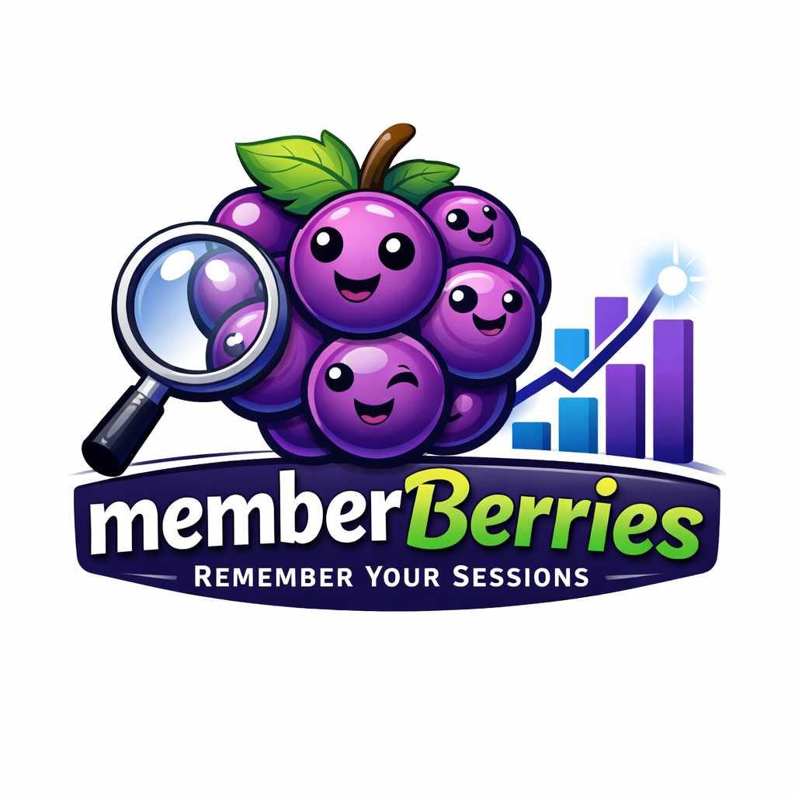

<p align="center">
  
</p>

<h1 align="center">MemberBerries</h1>

<p>
  A local-first dashboard for tracking your AI coding agent activity across Claude Code, Codex, Cursor, and GitHub Copilot. See what you worked on, how many tokens you used, and drill into session details — all from a single unified view.
</p>

## Features

- **Day View** — sessions grouped by calendar day with expandable cards
- **Sessions View** — flat list with search, filters, and full session detail drill-down
- **Analytics** — token usage by agent and model, period filtering (today/week/month/all time)
- **Multi-Agent** — supports Claude Code, Codex, Cursor, and GitHub Copilot
- **Agent Filter Pills** — toggle between All agents or filter to a specific one
- **Prompt Timeline** — see the sequence of prompts in each session
- **Session Replay** — rewatch any Claude Code session with animated character-by-character streaming; hover a session card or open the detail panel and click the play button to open a slide-in replay panel
- **Redaction** — secrets (API keys, tokens, connection strings) scrubbed before display
- **Local-First** — all data stays on your machine. No cloud, no accounts.

## Prerequisites

- **Node.js** 20+ (LTS recommended)
- **npm** 9+
- At least one AI coding agent installed:
  - [Claude Code](https://docs.anthropic.com/en/docs/claude-code) (`~/.claude/`)
  - [Codex](https://github.com/openai/codex) (`~/.codex/`)
  - [Cursor](https://cursor.sh) (`~/.cursor/`)
  - [GitHub Copilot](https://github.com/features/copilot) (`~/.copilot/`)

## Quick Start

```bash
# Clone the repo
git clone https://github.com/llaskin/MemberBerries.git
cd MemberBerries/desktop

# Install dependencies
npm install

# Start the dev server
npm run dev
```

The app starts at **http://localhost:1420**. Open it in your browser.

## What You'll See

The sidebar has three views:

| View | Description |
|------|-------------|
| **Agent Sessions** | Day/Sessions tabs showing all your AI coding sessions |
| **Analytics** | Token usage charts by agent and model with period filtering |
| **Settings** | Theme toggle and app configuration |

## How It Works

Agent Sessions reads session data directly from your local agent directories:

| Agent | Data Source | What's Extracted |
|-------|-----------|-----------------|
| Claude Code | `~/.claude/projects/*/` | Full transcripts, tool calls, files touched, tokens, model |
| Codex | `~/.codex/state_5.sqlite` | Threads, token counts, model from config |
| Cursor | `~/.cursor/ai-tracking/` | Code completions grouped by conversation |
| GitHub Copilot | `~/.copilot/command-history-state.json` | CLI command history (limited data) |

All data is read-only — Agent Sessions never modifies your agent data files.

## Security

- All data stays local. The Express server binds to `127.0.0.1` only.
- No remote URLs loaded. No telemetry. No auto-update.
- Secrets (API keys, tokens, connection strings, JWTs) are redacted before display.
- No shell spawning or terminal access.
- See `docs/data-flow-diagram.md` for the full data flow.

## Development

```bash
# Run tests
cd desktop && npx vitest run

# Type check
cd desktop && npx tsc --noEmit

# Build for production
cd desktop && npm run build
```

## License

MIT
