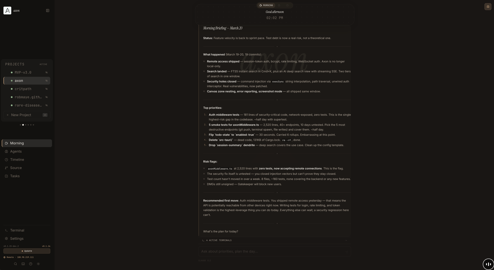
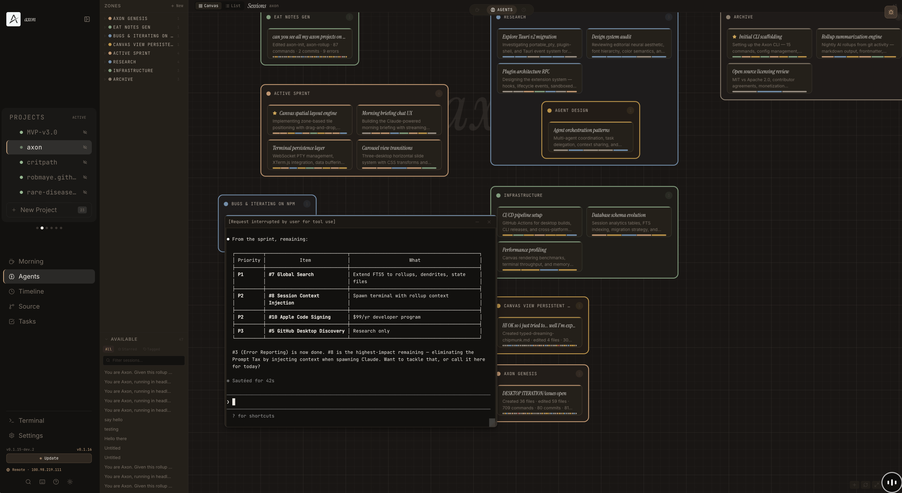
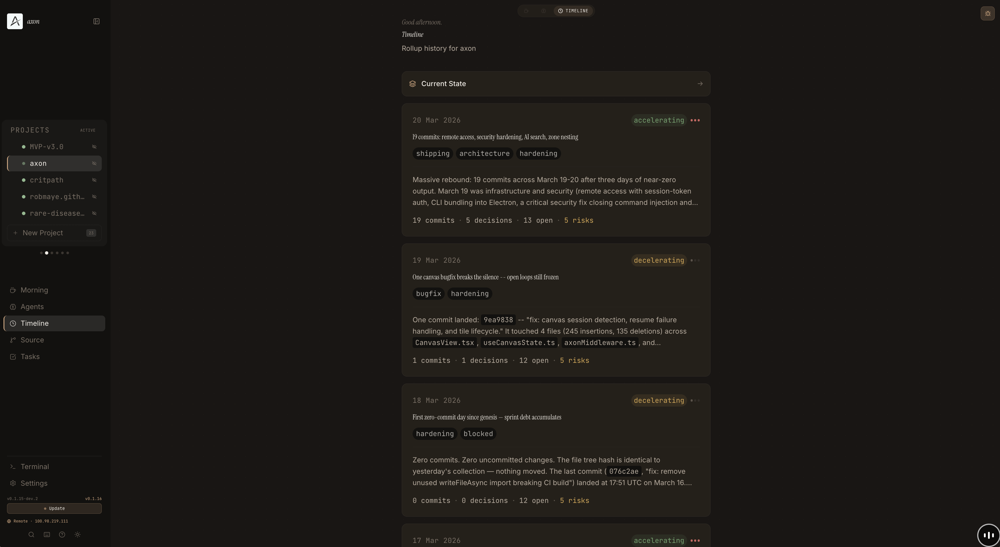

<p align="center">
  
</p>

<h1 align="center">Axon</h1>

<p align="center">
  Developer memory system. Nightly AI rollups, morning briefings, decision traces.<br/>
  <strong>CLI + Desktop app.</strong> Open source (MIT).
</p>

<p align="center">
  <a href="https://github.com/AxonEmbodied/AXON/releases/latest"></a>
  <a href="https://github.com/AxonEmbodied/AXON/blob/main/LICENSE"></a>
  <a href="https://discord.gg/kMw4XKn7v7"></a>
</p>

---

Your AI forgets everything between sessions. Axon doesn't.

It watches what you build, synthesises what happened overnight, and briefs you every morning. All stored as local markdown files you own. No cloud. No accounts. No vendor lock-in.

## Quick Start

```bash
npm i -g axon-dev
axon init --project my-app --path ~/Github/my-app
axon cron install    # set up nightly rollups
axon morning         # your first briefing
```

Or grab the [desktop app](https://github.com/AxonEmbodied/axon/releases?q=desktop-v) (macOS).

## What It Does

```bash
axon collect    # gather signals — git log, file tree, session activity
axon rollup     # nightly AI synthesis — what happened, what was decided, what matters
axon morning    # conversational briefing — where you are, what to focus on
```

**Every rollup captures decision traces** — what the input was, what constraints existed, what tradeoffs were weighed, what was decided. These compound over time into a searchable history of *why* your project looks the way it does.

### Morning Briefing



Your day starts with full context. Priorities, risk flags, open loops, recommended first move — synthesised from last night's rollup.

### Spatial Canvas



All your Claude Code sessions as tiles on an infinite workspace. Organise into zones. Click any tile to open a live terminal. The layout is the context.

### Timeline



Rollup cards showing decisions, commits, risk flags, and momentum over time. Expand any card to see decision traces.

## Where Memory Lives

```
~/.axon/workspaces/my-project/
├── state.md              # current context snapshot
├── stream.md             # append-only raw log
├── episodes/             # nightly rollups
│   └── 2026-03-12_rollup.md
├── dendrites/            # raw input signals
├── mornings/             # briefing conversations
└── config.yaml           # project config
```

Plain text. Git-versioned on every rollup. Readable in twenty years with `cat`. If Axon dies tomorrow, your data survives. There's nothing to migrate away from.

## Architecture

- **CLI**: ~12 bash scripts. Zero dependencies beyond bash, jq, git, and Claude Code.
- **Desktop**: Vite + React + Zustand + Tailwind + xterm.js
- **Bridge**: Filesystem (`~/.axon/`) + HTTP API
- **Terminals**: node-pty with WebSocket, 60s grace period
- **Search**: SQLite FTS5 for sessions, deep AI search with Claude
- **Remote access**: Thin client model — server on one machine, browser on another via Tailscale

## Install

### CLI (npm)

```bash
npm i -g axon-dev
```

### Desktop (macOS)

[](https://github.com/AxonEmbodied/axon/releases/latest)

### From source

```bash
git clone https://github.com/AxonEmbodied/axon.git
cd axon/desktop
npm install
npm run dev
```

## Why Files, Not Weights

The full argument is in [the blog post](https://robmaye.github.io/blog/open-sourcing-my-exoskeleton), but the short version:

- **Fine-tuning** encodes behaviour. **Files** store facts. Different problems.
- Your `.axon/` directory works with any model. Your LoRA adapter doesn't.
- You can read, diff, grep, and fork files. You can't fork weights.
- If you ever want to fine-tune, Axon files are structured training data. The reverse isn't true.

## Community

- **[Discord](https://discord.gg/kMw4XKn7v7)** — where design decisions get made before they hit the repo
- **[Blog](https://robmaye.github.io/blog/open-sourcing-my-exoskeleton)** — the full thesis
- **[X / Twitter](https://x.com/AXONEMBODIED)** — updates and builds in public

## License

MIT — fork it, extend it, build something better.
